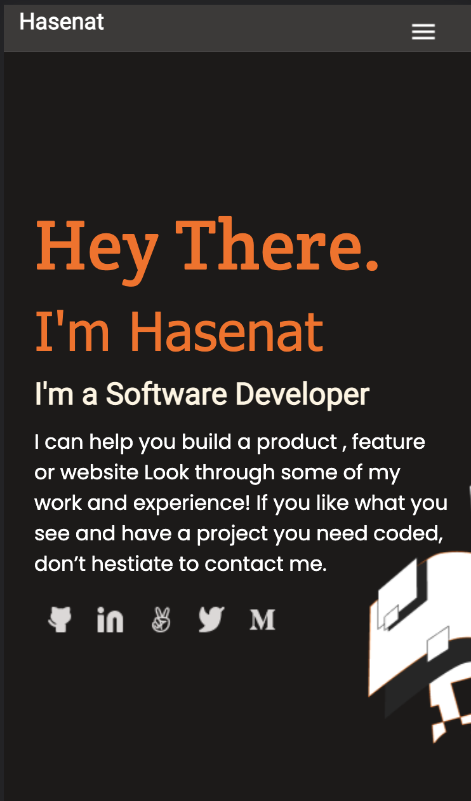

  

  <h1><b>Hasenat Eqbali's Portfolio</b></h1>

<!-- TABLE OF CONTENTS -->

# 📗 Table of Contents

- [📖 About the Project](#about-project)
     - [🛠 Built With](#built-with)
     - [🚀 Live Demo](#live-demo)
- [👥 Authors](#authors)
- [📝 License](#license)

<!-- PROJECT DESCRIPTION -->

# 📖 Portfolio 

 Experienced Lead with a demonstrated history of working in the Computer Software industry. Skilled in Management, Motivational Speaking, Leadership, Community Development, and Web Development.
  

## 🛠 Built With <a name="built-with">HTML & CSS</a>

to build this project,I have used from HTML version 5 for the structure and CSS for designig.  

<!-- LIVE DEMO -->

## 🚀 Live Demo <a name="live-demo">

<h3> Here is a screenshot of my protfolio, open and enjoy reading. </h3>

   

</a>

(<a href="#readme-top">back to top</a>)

<!-- AUTHORS -->

## 👥 Authors 

> Hasenat Eqbali

👤 **Author**

- GitHub: [Hasenat Eqbali](https://github.com/hasenat-eqbali)
- LinkedIn: [Hasenat Eqbali](https://linkedin.com/in/hasenat-eqbali)

(<a href="#readme-top">back to top</a>)

<!-- LICENSE -->

## 📝 License 

This project is [MIT](./LICENSE) licensed.

_NOTE: we recommend using the [MIT license](https://choosealicense.com/licenses/mit/) - you can set it up quickly by [using templates available on GitHub](https://docs.github.com/en/communities/setting-up-your-project-for-healthy-contributions/adding-a-license-to-a-repository). You can also use [any other license](https://choosealicense.com/licenses/) if you wish._

(<a href="#readme-top">back to top</a>)

